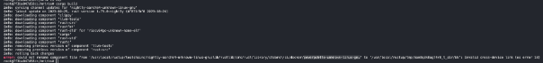
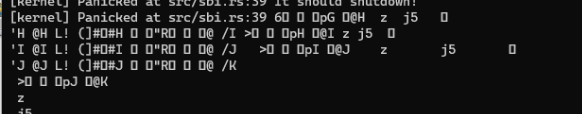
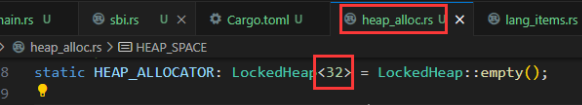

# 第三章

Q：

A：这个问题很经典，会有很多人遇到，其实是rustup的bug，解决方法很简单，重装：

```rust
rustup toolchain uninstall nightly
rustup toolchain install nightly
```

Q: 文档里的所有操作都是从官方仓库克隆的，我们要从classroom生成的仓库里操作，要和文档里一样克隆出官方的user吗？

A: 需要，后续需要user的ch分支make时会提示，方法是回到2023a-rcore-xxxx目录，然后执行：

```sh
git clone https://github.com/LearningOS/rCore-Tutorial-Test-2023A.git user
```

Q1:  替换了rustsbin-qemu.bin之后，ch3出现qemu停止异常，打印乱码


Q2: buddy_system_allocator升级到最新有些变化：



A: 我的环境做了Q2的改变，出现停止异常，后恢复到0.6版本、rustsbi-qemu.bin恢复依然报错，而且是两套环境都报错(gentoo qemu8.1.2和docker Ubuntu20.04+qemu7.0.0)。做了如下修改后，两套环境都正常。之所以待确认，是我并不能确认是否这个修改修正了关机问题，只是在这列出来给遇到相同问题的小伙伴一个参考。新的shutdown多接收一个参数，functionid也变成了0，原来是8，返回值从a1接收，忽略a0返回的error。

首先，增加一个新的sbi_call_4，用x10~x17也行，个人觉得a0~a7更直观

```rust
#[inline(always)]
fn sbi_call_4(eid: usize, fid: usize, arg0: usize, arg1: usize, arg2: usize) -> usize {
    let mut ret;
    unsafe {
        asm!(
            "ecall",
            inlateout("a0") arg0 => _,
            inlateout("a1") arg1 => ret,
            in("a2") arg2,
            in("a6") fid,
            in("a7") eid,
        );
    }
    ret
}
```

还有一些关机相关的枚举和常量：

```rust
// system reset extension
// https://github.com/riscv-non-isa/riscv-sbi-doc/blob/master/riscv-sbi.adoc#system-reset-extension-eid-0x53525354-srst
const SRST_EXTENSION: usize = 0x53525354;
const SYSTEM_RESET_FUNCTION: usize = 0;
enum SystemResetType {
    Shutdown = 0,
    ColdReboot = 1,
    WarmReboot = 2,
}
enum SystemResetReason {
    NoReason = 0,
    SystemFailure = 1,
}
```

最后是修改shutdown的实现：

```rust
/// use sbi call to shutdown the kernel
pub fn shutdown() -> ! {
    sbi_call_4(
        SRST_EXTENSION,
        SYSTEM_RESET_FUNCTION,
        SystemResetType::Shutdown as usize,
        SystemResetReason::NoReason as usize,
        0,
    );
    panic!("It should shutdown!");
}
```
